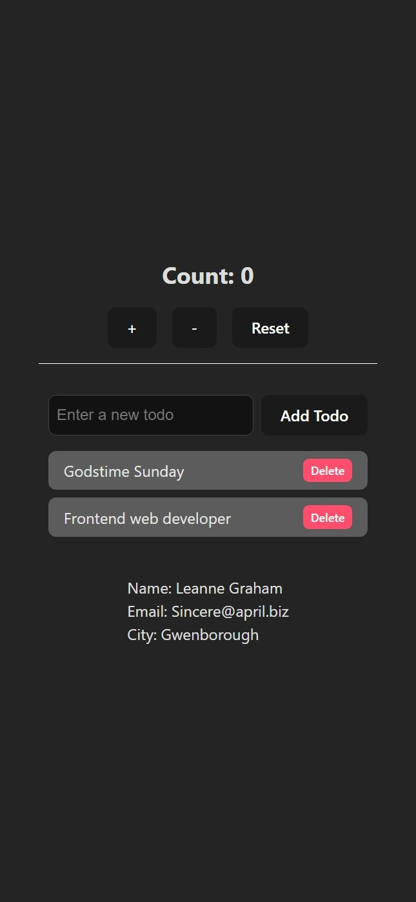

## Overview

This project demonstrates the implementation and usage of React Hooks (useState and useEffect) in a basic React application.

## Features

- Functional components with Hooks
- State management with `useState`
- Side effects with `useEffect`
- Context API integration
